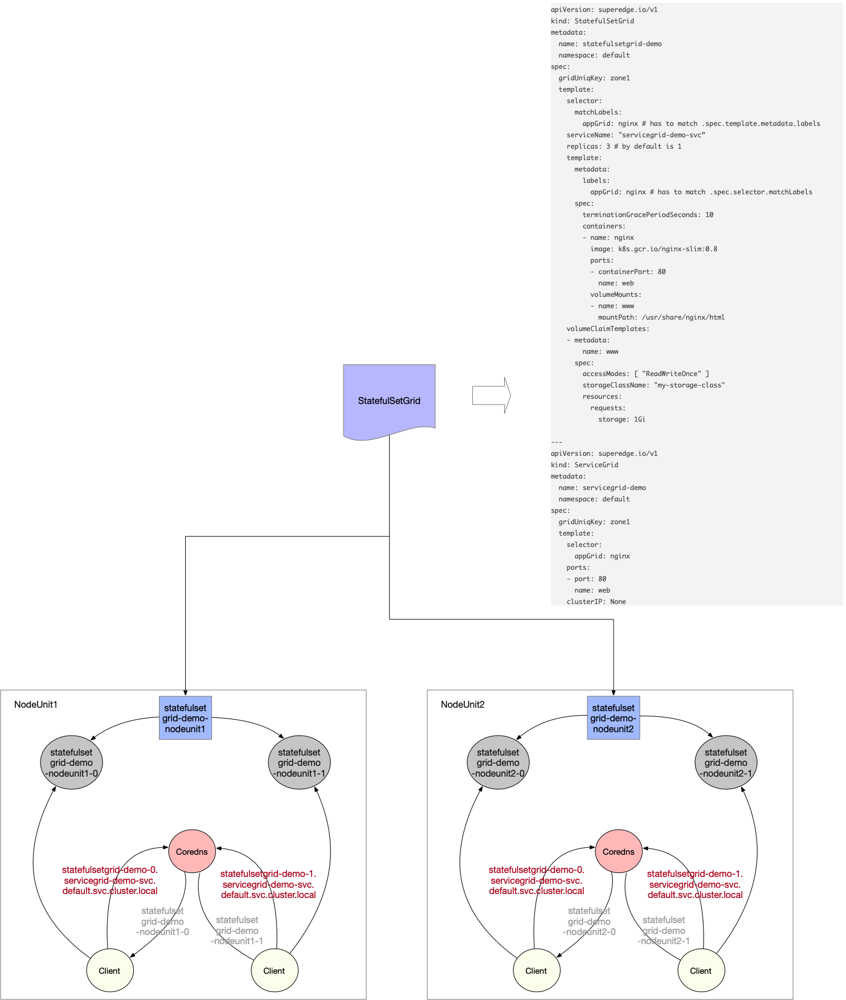

SuperEdge StatefulSetGrid源码分析
===============================

## 前言

SuperEdge StatefulSetGrid由本人在官方提出方案[SEP: ServiceGroup StatefulSetGrid Design Specification](https://github.com/superedge/superedge/issues/26)，最终与[chenkaiyue](https://github.com/chenkaiyue)合作开发完成

初衷是为了补充service group对有状态服务的支持，设计架构图如下：



这里先介绍一下StatefulSetGrid的使用示例，有一个直观的感受：

1、部署StatefulSetGrid

```yaml
apiVersion: superedge.io/v1
kind: StatefulSetGrid
metadata:
  name: statefulsetgrid-demo
  namespace: default
spec:
  gridUniqKey: zone
  template:
    selector:
      matchLabels:
        appGrid: echo
    serviceName: "servicegrid-demo-svc"
    replicas: 3
    template:
      metadata:
        labels:
          appGrid: echo
      spec:
        terminationGracePeriodSeconds: 10
        containers:
        - image: superedge/echoserver:2.2
          name: echo
          ports:
          - containerPort: 8080
            protocol: TCP
          env:
            - name: NODE_NAME
              valueFrom:
                fieldRef:
                  fieldPath: spec.nodeName
            - name: POD_NAME
              valueFrom:
                fieldRef:
                  fieldPath: metadata.name
            - name: POD_NAMESPACE
              valueFrom:
                fieldRef:
                  fieldPath: metadata.namespace
            - name: POD_IP
              valueFrom:
                fieldRef:
                  fieldPath: status.podIP
          resources: {}
```

**注意：template中的serviceName设置成即将创建的service名称**

2、部署StatefulSetGrid

```yaml
apiVersion: superedge.io/v1
kind: StatefulSetGrid
metadata:
  name: servicegrid-demo
  namespace: default
spec:
  gridUniqKey: zone
  template:
    selector:
      appGrid: echo
    ports:
    - protocol: TCP
      port: 80
      targetPort: 8080
```

gridUniqKey字段设置为了zone，所以我们在将节点分组时采用label的key为zone，如果有三组节点，分别为他们添加zone: zone-0, zone: zone-1, zone: zone-2的label即可；这时，每组节点内都有了echo-service的statefulset和对应的pod，在节点内访问统一的service-name也只会将请求发向本组的节点

```
[~]# kubectl get ssg
NAME                   AGE
statefulsetgrid-demo   21h

[~]# kubectl get statefulset
NAME                          READY   AGE
statefulsetgrid-demo-zone-0   3/3     21h
statefulsetgrid-demo-zone-1   3/3     21h
statefulsetgrid-demo-zone-2   3/3     21h

[~]# kubectl get svc
NAME                   TYPE        CLUSTER-IP     EXTERNAL-IP   PORT(S)   AGE
kubernetes             ClusterIP   192.168.0.1     <none>        443/TCP   22h
servicegrid-demo-svc   ClusterIP   192.168.21.99   <none>        80/TCP    21h

# execute on zone-0 nodeunit
[~]# curl 192.168.21.99|grep "node name"
        node name:      node0
...
# execute on zone-1 nodeunit
[~]# curl 192.168.21.99|grep "node name"
        node name:      node1
...
# execute on zone-2 nodeunit
[~]# curl 192.168.21.99|grep "node name"
        node name:      node2
...
```

**注意：在各NodeUnit内通过service访问本组服务时，对应clusterIP不能设置成None，暂不支持此种情况下的闭环访问**

除了采用service访问statefulset负载，StatefulSetGrid还支持使用headless service的方式进行访问，如下所示：


StatefulSetGrid提供屏蔽NodeUnit的统一headless service访问形式，如下：

```
{StatefulSetGrid}-{0..N-1}.{StatefulSetGrid}-svc.ns.svc.cluster.local
```

上述访问会对应实际各个NodeUnit的具体pod：

```
{StatefulSetGrid}-{NodeUnit}-{0..N-1}.{StatefulSetGrid}-svc.ns.svc.cluster.local
```

每个NodeUnit通过相同的headless service只会访问本组内的pod。也即：对于`NodeUnit：zone-1`来说，会访问`statefulsetgrid-demo-zone-1`(statefulset)对应的pod；而对于`NodeUnit：zone-2`来说，会访问`statefulsetgrid-demo-zone-2`(statefulset)对应的pod

```bash
# execute on zone-0 nodeunit
[~]# curl statefulsetgrid-demo-0.servicegrid-demo-svc.default.svc.cluster.local|grep "pod name"
        pod name:       statefulsetgrid-demo-zone-0-0
[~]# curl statefulsetgrid-demo-1.servicegrid-demo-svc.default.svc.cluster.local|grep "pod name"
        pod name:       statefulsetgrid-demo-zone-0-1
[~]# curl statefulsetgrid-demo-2.servicegrid-demo-svc.default.svc.cluster.local|grep "pod name"
        pod name:       statefulsetgrid-demo-zone-0-2
...
# execute on zone-1 nodeunit
[~]# curl statefulsetgrid-demo-0.servicegrid-demo-svc.default.svc.cluster.local|grep "pod name"
        pod name:       statefulsetgrid-demo-zone-1-0
[~]# curl statefulsetgrid-demo-1.servicegrid-demo-svc.default.svc.cluster.local|grep "pod name"
        pod name:       statefulsetgrid-demo-zone-1-1
[~]# curl statefulsetgrid-demo-2.servicegrid-demo-svc.default.svc.cluster.local|grep "pod name"
        pod name:       statefulsetgrid-demo-zone-1-2
...
# execute on zone-2 nodeunit
[~]# curl statefulsetgrid-demo-0.servicegrid-demo-svc.default.svc.cluster.local|grep "pod name"
        pod name:       statefulsetgrid-demo-zone-2-0
[~]# curl statefulsetgrid-demo-1.servicegrid-demo-svc.default.svc.cluster.local|grep "pod name"
        pod name:       statefulsetgrid-demo-zone-2-1
[~]# curl statefulsetgrid-demo-2.servicegrid-demo-svc.default.svc.cluster.local|grep "pod name"
        pod name:       statefulsetgrid-demo-zone-2-2
...
```

在熟悉StatefulSetGrid的基本使用后，我们深入源码分析

## 源码分析

StatefulSetGrid包括两部分组件：

* StatefulSetGrid Controller(云端)：负责根据StatefulSetGrid CR(custom resource) 创建&维护 各nodeunit对应的statefulset
* statefulset-grid-daemon(边缘)：负责生成各nodeunit对应statefulset负载的域名hosts记录((A records))，以便用户屏蔽nodeunit，通过`{StatefulSetGrid}-{0..N-1}.{StatefulSetGrid}-svc.ns.svc.cluster.local`形式访问有状态服务

这里依次对上述组件进行分析：

### StatefulSetGrid Controller

StatefulSetGrid Controller逻辑和DeploymentGrid Controller整体一致，如下：

1、创建并维护service group需要的若干CRDs(包括：StatefulSetGrid)
2、监听StatefulSetGrid event，并填充StatefulSetGrid到工作队列中；循环从队列中取出StatefulSetGrid进行解析，创建并且维护各nodeunit对应的statefulset
3、监听statefulset以及node event，并将相关的StatefulSetGrid塞到工作队列中进行上述处理，协助上述逻辑达到整体reconcile效果

注意各nodeunit创建的statefulset以`{StatefulSetGrid}-{nodeunit}`命名，同时添加了nodeSelector限制(`GridUniqKey: nodeunit`)


